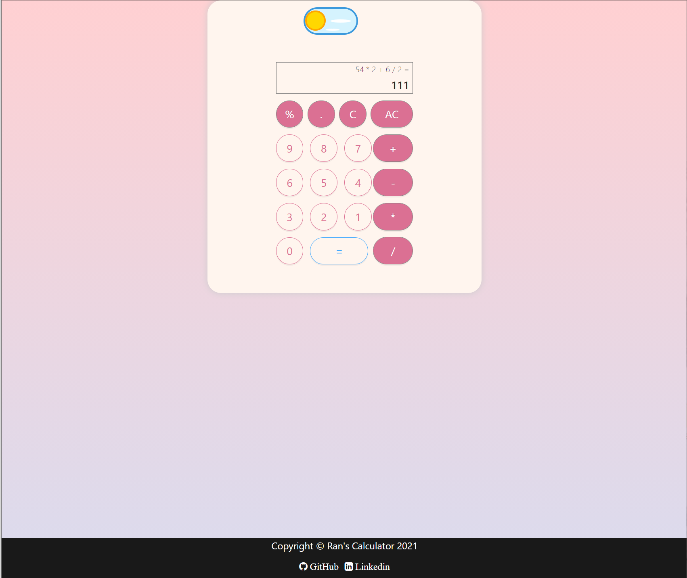
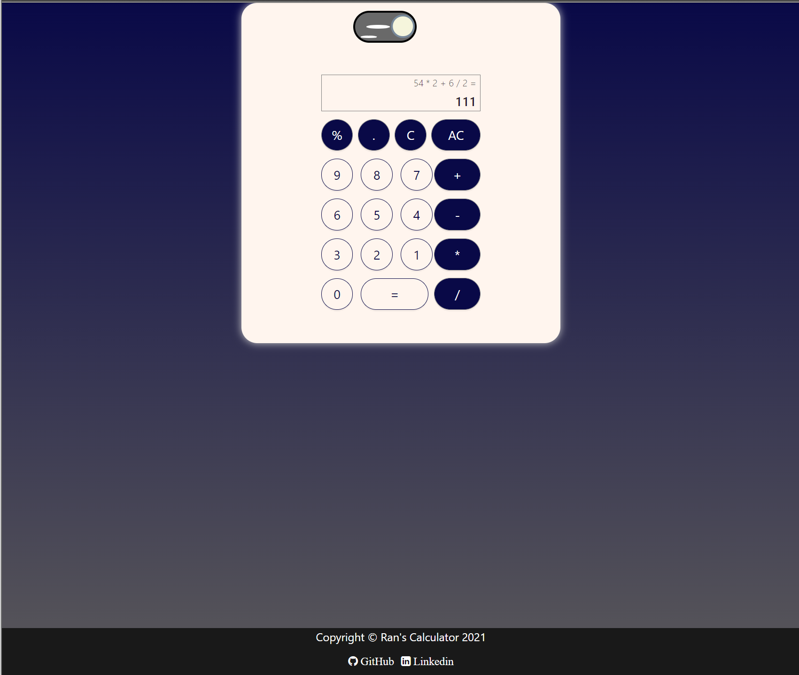

# Calculator :nail_care: (a pretty one)

### Table of Contents

- [Description](#description)
- [License](#license)
- [Author Info](#author-info)

---

## Description

As the project name suggested, it is a calculator. Built it from scratch after I learnt React on Coursera and read docs on Typescript.

It can be accessed at the link below.

> https://rand-calculator.netlify.app/

#### Technologies

- Frontend: React.js, TypeScript, HTML & CSS
- Cloud: Netlify deploy

---

## License

MIT License

---

## Get in touch

  <a href="https://www.instagram.com/ranwren/">
    
@ranwren

    
  </a>
<a href="https://www.linkedin.com/in/ding-ran/">
  
@Ran Ding

    
  </a>

[Back To The Top](#)
